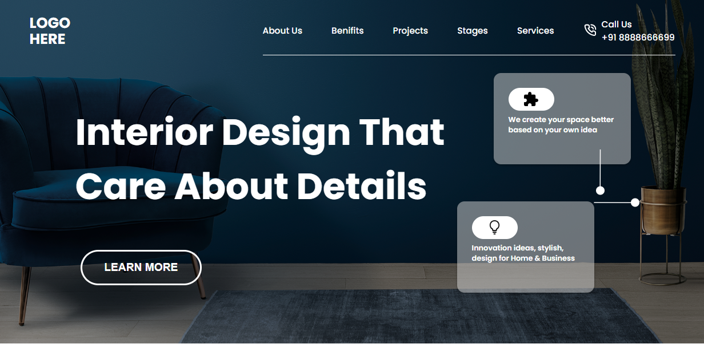

## INEURON_CHALLENGE-PROJECT-10

---

## Project 10

---

## What I learned from this Project?

- Learnd about **transform in css**.
- Learnd about **background-image in css**.

---

# Time to finish this project

---
# Screenshots
